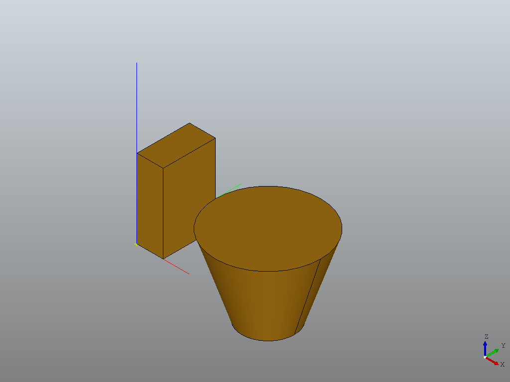
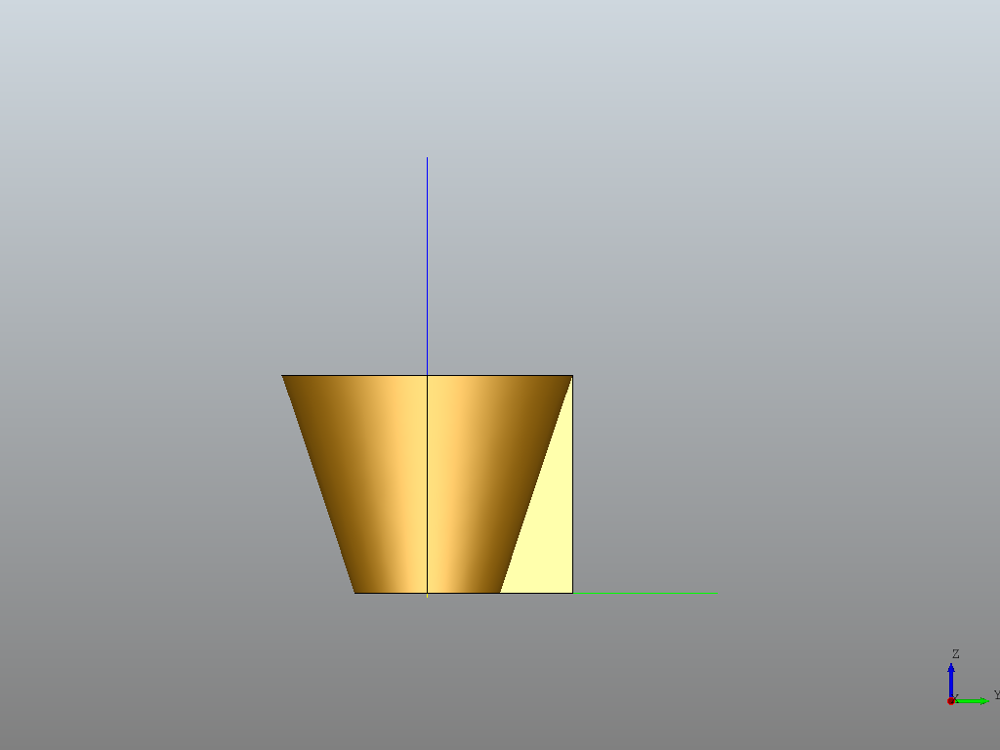
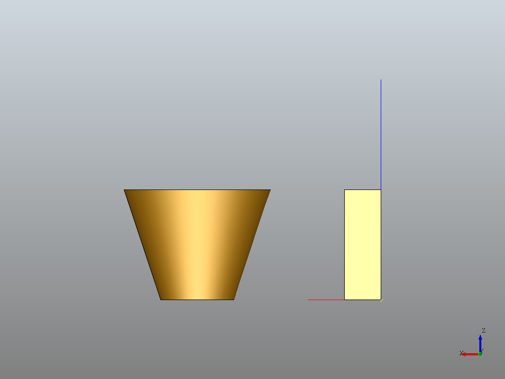
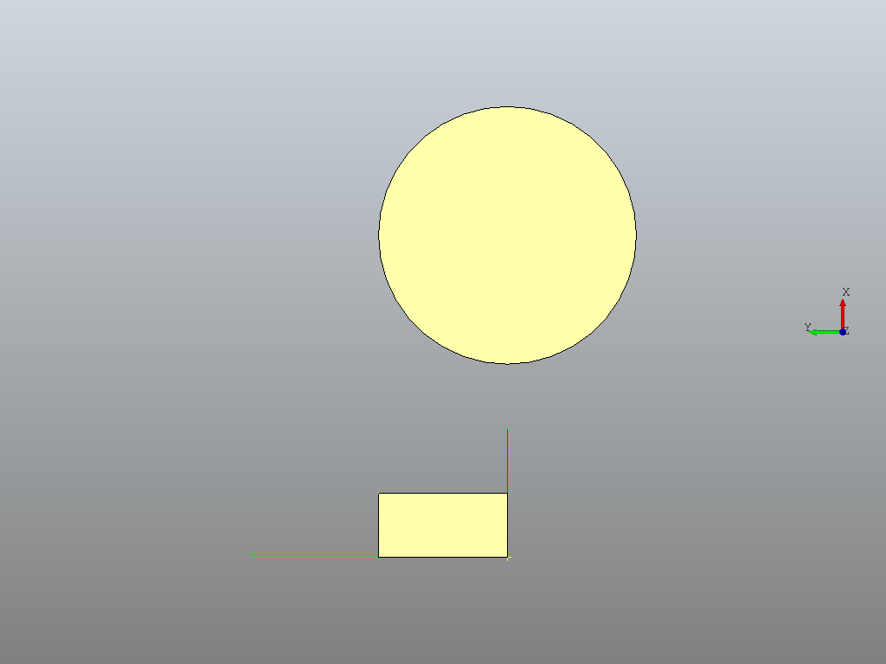

# NOTE

- <https://dev.opencascade.org/doc/overview/html/index.html>

```bash
python -c 'from base import create_tempdir;create_tempdir(flag=-1)'
```

## OCC-Camera.py

| x                     | y                     | z                     |
| --------------------- | --------------------- | --------------------- |
|    |
|  |  |  |
